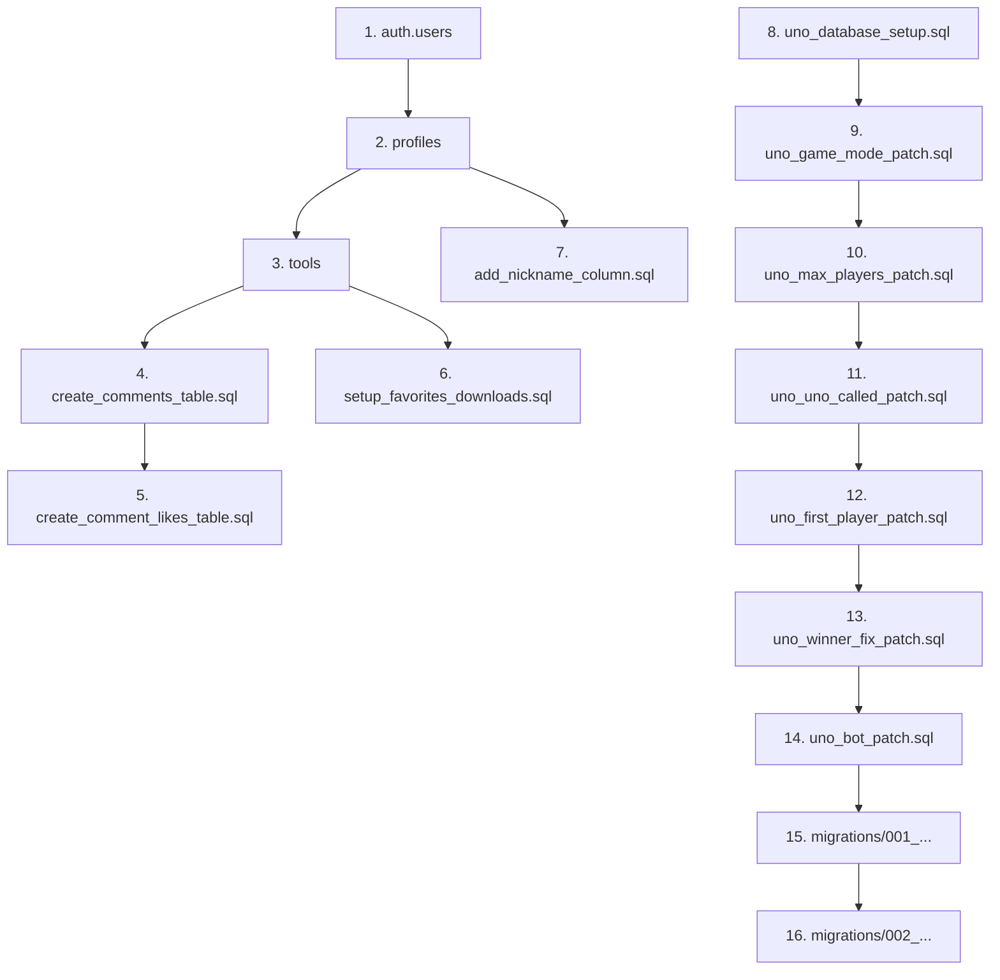

# Friday Hub 数据库文档

## 目录

1. [概述](#1-概述)
2. [数据库架构](#2-数据库架构)
3. [核心表结构](#3-核心表结构)
4. [UNO 游戏表](#4-uno-游戏表)
5. [索引设计](#5-索引设计)
6. [RLS 安全策略](#6-rls-安全策略)
7. [SQL 文件索引](#7-sql-文件索引)
8. [执行顺序](#8-执行顺序)
9. [常见操作](#9-常见操作)

---

## 1. 概述

### 1.1 数据库类型

本项目使用 **Supabase PostgreSQL** 数据库，版本为 PostgreSQL 15+。

### 1.2 核心特性

- **Row Level Security (RLS)**：行级安全策略，确保数据隔离
- **Realtime**：实时数据订阅，用于游戏状态同步
- **Triggers**：自动更新 `updated_at` 字段
- **JSONB**：灵活存储复杂结构（游戏状态、计分板等）

### 1.3 Schema 概览

```
┌─────────────────────────────────────────────────────────────────────┐
│                          public schema                               │
├─────────────────────────────────────────────────────────────────────┤
│  核心业务表                                                          │
│  ┌─────────────┐  ┌─────────────┐  ┌─────────────┐                 │
│  │  profiles   │  │   tools     │  │  comments   │                 │
│  └──────┬──────┘  └──────┬──────┘  └──────┬──────┘                 │
│         │                │                │                         │
│         │         ┌──────┴──────┐  ┌──────┴──────┐                 │
│         │         │  favorites  │  │comment_likes│                 │
│         │         └─────────────┘  └─────────────┘                 │
│         │                 │                                        │
│         │         ┌───────┴───────┐                                │
│         │         │download_records│                               │
│         │         └───────────────┘                                │
├─────────────────────────────────────────────────────────────────────┤
│  UNO 游戏表                                                          │
│  ┌─────────────┐     ┌─────────────┐                               │
│  │  uno_rooms  │────<│ uno_players │                               │
│  └──────┬──────┘     └─────────────┘                               │
│         │                                                           │
│         │ 1:1                                                       │
│         ▼                                                           │
│  ┌─────────────┐     ┌─────────────┐                               │
│  │uno_game_state│───<│ uno_actions │                               │
│  └─────────────┘     └─────────────┘                               │
└─────────────────────────────────────────────────────────────────────┘
```

---

## 2. 数据库架构

### 2.1 表关系图

```
profiles (用户资料)
    │
    ├──< favorites (收藏)
    │       └──> tools
    │
    ├──< download_records (下载记录)
    │       └──> tools
    │
    ├──< comments (评论)
    │       └──> tools
    │
    ├──< comment_likes (评论点赞)
    │       └──> comments
    │
    └──< uno_players (UNO 玩家)
            └──> uno_rooms
                    └──> uno_game_state
                            └──> uno_actions
```

### 2.2 外键约束

| 子表 | 外键字段 | 父表 | 级联删除 |
|------|---------|------|---------|
| `favorites` | `user_id` | `auth.users` | ✅ |
| `favorites` | `tool_id` | `tools` | ✅ |
| `download_records` | `user_id` | `auth.users` | ✅ |
| `comments` | `user_id` | `auth.users` | ✅ |
| `comments` | `tool_id` | `tools` | ✅ |
| `comment_likes` | `user_id` | `auth.users` | ✅ |
| `comment_likes` | `comment_id` | `comments` | ✅ |
| `uno_rooms` | `host_id` | `profiles` | ✅ |
| `uno_players` | `room_id` | `uno_rooms` | ✅ |
| `uno_players` | `user_id` | `profiles` | ✅ |
| `uno_game_state` | `room_id` | `uno_rooms` | ✅ |
| `uno_actions` | `room_id` | `uno_rooms` | ✅ |

---

## 3. 核心表结构

### 3.1 `profiles` - 用户资料表

用户资料扩展表，与 `auth.users` 一对一关联。

```sql
CREATE TABLE profiles (
  id            UUID PRIMARY KEY REFERENCES auth.users(id) ON DELETE CASCADE,
  email         TEXT,
  display_name  TEXT,
  nickname      TEXT,          -- 用户自定义昵称
  avatar_url    TEXT,
  role          TEXT DEFAULT 'user',  -- 'user' | 'admin'
  created_at    TIMESTAMPTZ DEFAULT NOW(),
  updated_at    TIMESTAMPTZ DEFAULT NOW()
);
```

| 字段 | 类型 | 说明 |
|------|------|------|
| `id` | UUID | 主键，关联 auth.users |
| `email` | TEXT | 邮箱（冗余存储） |
| `display_name` | TEXT | 显示名称（来自 OAuth） |
| `nickname` | TEXT | 用户自定义昵称 |
| `avatar_url` | TEXT | 头像 URL |
| `role` | TEXT | 角色：`user` / `admin` |

### 3.2 `tools` - 工具列表表

```sql
CREATE TABLE tools (
  id            TEXT PRIMARY KEY,
  name          TEXT NOT NULL,
  description   TEXT,
  icon          TEXT,
  category      TEXT,           -- '效率工具' | '工作流' | '小游戏'
  tags          TEXT[],         -- 标签数组
  type          TEXT,           -- 'download' | 'workflow' | 'game' | 'online'
  download_url  TEXT,
  external_url  TEXT,
  sort_order    INT DEFAULT 0,  -- 排序权重
  download_count INT DEFAULT 0, -- 下载次数
  created_at    TIMESTAMPTZ DEFAULT NOW(),
  updated_at    TIMESTAMPTZ DEFAULT NOW()
);
```

| 字段 | 类型 | 说明 |
|------|------|------|
| `id` | TEXT | 工具 ID（如 '1', '2'） |
| `name` | TEXT | 工具名称 |
| `description` | TEXT | 工具描述 |
| `category` | TEXT | 分类 |
| `tags` | TEXT[] | 标签数组 |
| `type` | TEXT | 类型：下载/工作流/游戏/在线 |
| `download_url` | TEXT | 下载链接 |
| `external_url` | TEXT | 外部链接 |
| `sort_order` | INT | 排序权重（越小越靠前） |

### 3.3 `favorites` - 用户收藏表

```sql
CREATE TABLE favorites (
  id          UUID PRIMARY KEY DEFAULT gen_random_uuid(),
  user_id     UUID NOT NULL REFERENCES auth.users(id) ON DELETE CASCADE,
  tool_id     TEXT NOT NULL REFERENCES tools(id) ON DELETE CASCADE,
  created_at  TIMESTAMPTZ DEFAULT NOW(),
  
  UNIQUE(user_id, tool_id)  -- 每个用户只能收藏同一工具一次
);
```

### 3.4 `download_records` - 下载记录表

```sql
CREATE TABLE download_records (
  id            UUID PRIMARY KEY DEFAULT gen_random_uuid(),
  user_id       UUID NOT NULL REFERENCES auth.users(id) ON DELETE CASCADE,
  tool_id       TEXT NOT NULL,
  tool_name     TEXT NOT NULL,
  downloaded_at TIMESTAMPTZ DEFAULT NOW()
);
```

### 3.5 `comments` - 评论表

```sql
CREATE TABLE comments (
  id          UUID PRIMARY KEY DEFAULT gen_random_uuid(),
  user_id     UUID NOT NULL REFERENCES auth.users(id) ON DELETE CASCADE,
  content     TEXT NOT NULL,
  tool_id     TEXT REFERENCES tools(id) ON DELETE CASCADE,  -- NULL 表示首页评论
  parent_id   UUID REFERENCES comments(id) ON DELETE CASCADE, -- 父评论 ID
  created_at  TIMESTAMPTZ DEFAULT NOW(),
  updated_at  TIMESTAMPTZ DEFAULT NOW()
);
```

| 字段 | 类型 | 说明 |
|------|------|------|
| `tool_id` | TEXT | 关联工具 ID，NULL 表示首页留言 |
| `parent_id` | UUID | 父评论 ID，用于回复功能 |

### 3.6 `comment_likes` - 评论点赞表

```sql
CREATE TABLE comment_likes (
  id          UUID PRIMARY KEY DEFAULT gen_random_uuid(),
  user_id     UUID NOT NULL REFERENCES auth.users(id) ON DELETE CASCADE,
  comment_id  UUID NOT NULL REFERENCES comments(id) ON DELETE CASCADE,
  created_at  TIMESTAMPTZ DEFAULT NOW(),
  
  UNIQUE(user_id, comment_id)  -- 每个用户只能点赞一次
);
```

---

## 4. UNO 游戏表

### 4.1 `uno_rooms` - 游戏房间表

```sql
CREATE TABLE uno_rooms (
  id            UUID PRIMARY KEY DEFAULT gen_random_uuid(),
  room_code     VARCHAR(6) UNIQUE NOT NULL,  -- 6位房间码
  host_id       UUID REFERENCES profiles(id) ON DELETE CASCADE,
  status        VARCHAR(20) DEFAULT 'waiting' CHECK (status IN ('waiting', 'playing', 'finished')),
  max_players   INT DEFAULT 4 CHECK (max_players BETWEEN 2 AND 10),
  game_mode     VARCHAR(20) DEFAULT 'standard',  -- 'standard' | 'entertainment'
  scoring_mode  VARCHAR(20) DEFAULT 'basic',     -- 'basic' | 'ranking'
  score_board   JSONB,                           -- 累计计分板
  created_at    TIMESTAMPTZ DEFAULT NOW(),
  expires_at    TIMESTAMPTZ DEFAULT NOW() + INTERVAL '2 hours'
);
```

| 字段 | 类型 | 说明 |
|------|------|------|
| `room_code` | VARCHAR(6) | 6位房间码，唯一 |
| `host_id` | UUID | 房主 ID |
| `status` | VARCHAR(20) | 状态：waiting/playing/finished |
| `max_players` | INT | 最大玩家数（2-10） |
| `game_mode` | VARCHAR(20) | 游戏模式：standard/entertainment |
| `scoring_mode` | VARCHAR(20) | 计分模式：basic/ranking |
| `score_board` | JSONB | 累计计分板数据 |
| `expires_at` | TIMESTAMPTZ | 过期时间（2小时后） |

### 4.2 `uno_players` - 房间玩家表

```sql
CREATE TABLE uno_players (
  id          UUID PRIMARY KEY DEFAULT gen_random_uuid(),
  room_id     UUID REFERENCES uno_rooms(id) ON DELETE CASCADE,
  user_id     TEXT,           -- 真人 UUID 或 'bot_xxx'
  seat_index  INT CHECK (seat_index BETWEEN 0 AND 9),
  is_ready    BOOLEAN DEFAULT FALSE,
  joined_at   TIMESTAMPTZ DEFAULT NOW(),
  
  UNIQUE(room_id, user_id),
  UNIQUE(room_id, seat_index)
);
```

| 字段 | 类型 | 说明 |
|------|------|------|
| `user_id` | TEXT | 玩家 ID（TEXT 类型支持机器人 `bot_xxx`） |
| `seat_index` | INT | 座位号（0-9） |
| `is_ready` | BOOLEAN | 是否准备 |

### 4.3 `uno_game_state` - 游戏状态表

```sql
CREATE TABLE uno_game_state (
  id                    UUID PRIMARY KEY DEFAULT gen_random_uuid(),
  room_id               UUID REFERENCES uno_rooms(id) ON DELETE CASCADE UNIQUE,
  current_player_index  INT DEFAULT 0,
  direction             INT DEFAULT 1 CHECK (direction IN (1, -1)),
  current_color         VARCHAR(10) CHECK (current_color IN ('red', 'yellow', 'green', 'blue', 'black')),
  top_card              JSONB,              -- 当前顶牌
  draw_pile             JSONB DEFAULT '[]', -- 摸牌堆
  discard_pile          JSONB DEFAULT '[]', -- 弃牌堆
  hands                 JSONB DEFAULT '{}', -- 所有玩家手牌 {userId: [cards]}
  pending_draw_count    INT DEFAULT 0,      -- 待摸牌数（+2/+4叠加）
  winner_id             TEXT,               -- 获胜者 ID
  game_mode             VARCHAR(20) DEFAULT 'standard',
  rank_list             JSONB DEFAULT '[]', -- 排名列表（娱乐模式）
  uno_called            JSONB DEFAULT '{}', -- UNO 喊叫状态 {userId: boolean}
  first_player_id       TEXT,               -- 先手玩家 ID
  needs_color_pick      TEXT,               -- 待选色玩家 ID
  opening_data          JSONB,              -- 开场动画数据
  uno_window_open       BOOLEAN DEFAULT FALSE,
  uno_window_owner      TEXT,
  reported_this_window  JSONB DEFAULT '[]',
  updated_at            TIMESTAMPTZ DEFAULT NOW()
);
```

#### 核心字段说明

| 字段 | 类型 | 说明 |
|------|------|------|
| `hands` | JSONB | 所有玩家手牌，格式：`{"userId1": [card1, card2], "userId2": [...]}` |
| `top_card` | JSONB | 当前顶牌，格式：`{"id": "card_1", "color": "red", "type": "number", "value": 5}` |
| `pending_draw_count` | INT | 待摸牌数，用于 +2/+4 叠加 |
| `rank_list` | JSONB | 娱乐模式排名，格式：`["userId1", "userId2"]`（按出完牌顺序） |
| `uno_called` | JSONB | UNO 喊叫状态，格式：`{"userId": true}` |
| `opening_data` | JSONB | 开场动画数据（比牌结果等） |

#### UNO 窗口机制字段

| 字段 | 类型 | 说明 |
|------|------|------|
| `uno_window_open` | BOOLEAN | UNO 窗口是否开启 |
| `uno_window_owner` | TEXT | 开启窗口的玩家（打出倒数第二张牌） |
| `reported_this_window` | JSONB | 本窗口已举报玩家列表 |

### 4.4 `uno_actions` - 操作日志表

```sql
CREATE TABLE uno_actions (
  id            UUID PRIMARY KEY DEFAULT gen_random_uuid(),
  room_id       UUID REFERENCES uno_rooms(id) ON DELETE CASCADE,
  user_id       UUID REFERENCES profiles(id) ON DELETE CASCADE,
  action_type   VARCHAR(20) CHECK (action_type IN ('play', 'draw', 'uno', 'skip')),
  card          JSONB,              -- 出牌信息
  chosen_color  VARCHAR(10),        -- 选择的颜色（Wild 牌）
  created_at    TIMESTAMPTZ DEFAULT NOW()
);
```

| action_type | 说明 |
|-------------|------|
| `play` | 出牌 |
| `draw` | 摸牌 |
| `uno` | 喊 UNO |
| `skip` | 跳过（无牌可出且已摸牌） |

---

## 5. 索引设计

### 5.1 核心表索引

```sql
-- profiles
CREATE INDEX idx_profiles_email ON profiles(email);

-- tools
CREATE INDEX idx_tools_category ON tools(category);
CREATE INDEX idx_tools_sort_order ON tools(sort_order);

-- favorites
CREATE INDEX idx_favorites_user_id ON favorites(user_id);
CREATE INDEX idx_favorites_tool_id ON favorites(tool_id);

-- download_records
CREATE INDEX idx_download_records_user_id ON download_records(user_id);
CREATE INDEX idx_download_records_downloaded_at ON download_records(downloaded_at);

-- comments
CREATE INDEX idx_comments_tool_id ON comments(tool_id);
CREATE INDEX idx_comments_user_id ON comments(user_id);
CREATE INDEX idx_comments_parent_id ON comments(parent_id);
CREATE INDEX idx_comments_created_at ON comments(created_at DESC);

-- comment_likes
CREATE INDEX idx_comment_likes_comment_id ON comment_likes(comment_id);
CREATE INDEX idx_comment_likes_user_id ON comment_likes(user_id);
```

### 5.2 UNO 游戏索引

```sql
-- uno_rooms
CREATE INDEX idx_uno_rooms_room_code ON uno_rooms(room_code);
CREATE INDEX idx_uno_rooms_status ON uno_rooms(status);
CREATE INDEX idx_uno_rooms_expires_at ON uno_rooms(expires_at);

-- uno_players
CREATE INDEX idx_uno_players_room_id ON uno_players(room_id);
CREATE INDEX idx_uno_players_user_id ON uno_players(user_id);

-- uno_game_state
CREATE INDEX idx_uno_game_state_room_id ON uno_game_state(room_id);

-- uno_actions
CREATE INDEX idx_uno_actions_room_id ON uno_actions(room_id);
```

---

## 6. RLS 安全策略

### 6.1 策略概览

| 表 | SELECT | INSERT | UPDATE | DELETE |
|---|--------|--------|--------|--------|
| `profiles` | 所有人可见 | 仅自己 | 仅自己 | 仅自己 |
| `tools` | 所有人可见 | - | - | - |
| `favorites` | 仅自己 | 仅自己 | - | 仅自己 |
| `download_records` | 仅自己 | 仅自己 | - | - |
| `comments` | 所有人可见 | 登录用户 | 仅自己 | 仅自己 |
| `comment_likes` | 仅自己 | 仅自己 | - | 仅自己 |
| `uno_rooms` | 登录用户 | 仅房主 | 仅房主 | 仅房主 |
| `uno_players` | 登录用户 | 仅自己 | 仅自己 | 仅自己 |
| `uno_game_state` | 房间内玩家 | 仅房主 | 房间内玩家 | - |
| `uno_actions` | 房间内玩家 | 仅自己 | - | - |

### 6.2 关键策略示例

```sql
-- uno_game_state SELECT：房间内玩家可读
CREATE POLICY "uno_game_state_select"
  ON uno_game_state FOR SELECT
  USING (
    EXISTS (
      SELECT 1 FROM uno_players
      WHERE room_id = uno_game_state.room_id
        AND user_id = auth.uid()
    )
  );

-- uno_game_state UPDATE：房间内玩家可更新
CREATE POLICY "uno_game_state_update"
  ON uno_game_state FOR UPDATE
  USING (
    EXISTS (
      SELECT 1 FROM uno_players
      WHERE room_id = uno_game_state.room_id
        AND user_id = auth.uid()
    )
  );
```

---

## 7. SQL 文件索引

### 7.1 文件目录结构

```
database/sql/
├── core/                    # 核心业务表
│   ├── create_comments_table.sql      # 评论表
│   ├── create_comment_likes_table.sql # 评论点赞表
│   ├── add_nickname_column.sql        # 用户昵称字段
│   ├── setup_favorites_downloads.sql  # 收藏和下载记录
│   ├── cleanup_tools.sql              # 工具清理
│   └── create_storage_bucket.sql      # 存储桶配置
│
├── uno/                     # UNO 游戏相关
│   ├── uno_database_setup.sql         # 基础建表（必须首先执行）
│   ├── uno_game_mode_patch.sql        # 游戏模式字段
│   ├── uno_max_players_patch.sql      # 扩展玩家数到10人
│   ├── uno_uno_called_patch.sql       # UNO喊叫状态
│   ├── uno_first_player_patch.sql     # 先手玩家字段
│   ├── uno_winner_fix_patch.sql       # 获胜者字段类型修复
│   ├── uno_bot_patch.sql              # 机器人支持
│   ├── uno_actions_rls_patch.sql      # 操作日志RLS
│   └── uno_game_state_delete_policy.sql # 游戏状态删除策略
│
├── patches/                 # 修复补丁
│   ├── fix_profile_update.sql         # 修复用户资料更新
│   ├── fix_rls_policy.sql             # 修复RLS策略
│   ├── fix_updated_at.sql             # 修复updated_at触发器
│   ├── disable_rls.sql                # 临时禁用RLS（调试用）
│   └── update_rls_policies.sql        # 更新RLS策略
│
└── migrations/              # 数据迁移
    ├── 001_add_opening_data_to_uno_game_state.sql
    └── 002_add_uno_window_fields.sql
```

### 7.2 文件说明

#### 核心表文件

| 文件 | 用途 | 依赖 |
|------|------|------|
| `create_comments_table.sql` | 创建评论表和索引 | `auth.users`, `tools` |
| `create_comment_likes_table.sql` | 创建评论点赞表 | `comments` |
| `add_nickname_column.sql` | 为 profiles 添加昵称字段 | `profiles` |
| `setup_favorites_downloads.sql` | 创建收藏和下载记录表 | `auth.users`, `tools` |

#### UNO 游戏文件

| 文件 | 用途 | 执行时机 |
|------|------|---------|
| `uno_database_setup.sql` | 创建 UNO 4张核心表 | **首次部署** |
| `uno_game_mode_patch.sql` | 添加游戏模式字段 | 部署后 |
| `uno_max_players_patch.sql` | 扩展到10人 | 部署后 |
| `uno_uno_called_patch.sql` | 添加 UNO 状态字段 | 部署后 |
| `uno_first_player_patch.sql` | 添加先手玩家字段 | 部署后 |
| `uno_winner_fix_patch.sql` | 修复 winner_id 类型 | 部署后 |
| `uno_bot_patch.sql` | 机器人支持补丁 | 部署后 |
| `uno_actions_rls_patch.sql` | 操作日志 RLS | 部署后 |

---

## 8. 执行顺序

### 8.1 首次部署



### 8.2 执行脚本

在 Supabase SQL Editor 中按以下顺序执行：

#### Step 1: 核心表（如果 profiles 和 tools 不存在，需先创建）

```sql
-- 1. 评论表
\i database/sql/core/create_comments_table.sql

-- 2. 评论点赞表
\i database/sql/core/create_comment_likes_table.sql

-- 3. 收藏和下载记录
\i database/sql/core/setup_favorites_downloads.sql

-- 4. 用户昵称字段
\i database/sql/core/add_nickname_column.sql
```

#### Step 2: UNO 游戏表

```sql
-- 1. UNO 基础表（必须首先执行）
\i database/sql/uno/uno_database_setup.sql

-- 2. 游戏模式字段
\i database/sql/uno/uno_game_mode_patch.sql

-- 3. 扩展玩家数
\i database/sql/uno/uno_max_players_patch.sql

-- 4. UNO 喊叫状态
\i database/sql/uno/uno_uno_called_patch.sql

-- 5. 先手玩家字段
\i database/sql/uno/uno_first_player_patch.sql

-- 6. 获胜者字段修复
\i database/sql/uno/uno_winner_fix_patch.sql

-- 7. 机器人支持
\i database/sql/uno/uno_bot_patch.sql

-- 8. 操作日志 RLS
\i database/sql/uno/uno_actions_rls_patch.sql
```

#### Step 3: 数据迁移

```sql
-- 按编号顺序执行
\i database/sql/migrations/001_add_opening_data_to_uno_game_state.sql
\i database/sql/migrations/002_add_uno_window_fields.sql
```

---

## 9. 常见操作

### 9.1 清理过期房间

```sql
-- 手动清理过期房间
SELECT cleanup_expired_uno_rooms();

-- 或设置 pg_cron 定时任务
SELECT cron.schedule(
  'cleanup_uno_rooms',
  '0 * * * *',  -- 每小时执行
  'SELECT cleanup_expired_uno_rooms();'
);
```

### 9.2 查看活跃游戏

```sql
SELECT 
  r.id,
  r.room_code,
  r.status,
  r.game_mode,
  COUNT(p.id) as player_count,
  r.created_at
FROM uno_rooms r
LEFT JOIN uno_players p ON p.room_id = r.id
WHERE r.status = 'playing'
GROUP BY r.id
ORDER BY r.created_at DESC;
```

### 9.3 查看用户统计

```sql
SELECT 
  p.display_name,
  COUNT(DISTINCT f.id) as favorite_count,
  COUNT(DISTINCT d.id) as download_count,
  COUNT(DISTINCT c.id) as comment_count
FROM profiles p
LEFT JOIN favorites f ON f.user_id = p.id
LEFT JOIN download_records d ON d.user_id = p.id
LEFT JOIN comments c ON c.user_id = p.id
GROUP BY p.id, p.display_name
ORDER BY favorite_count DESC;
```

### 9.4 重置测试数据

```sql
-- ⚠️ 谨慎操作：删除所有 UNO 游戏数据
DELETE FROM uno_actions;
DELETE FROM uno_game_state;
DELETE FROM uno_players;
DELETE FROM uno_rooms;
```

### 9.5 备份表数据

```sql
-- 创建备份表
CREATE TABLE uno_game_state_backup AS 
SELECT * FROM uno_game_state;

-- 从备份恢复
INSERT INTO uno_game_state 
SELECT * FROM uno_game_state_backup;
```

---

## 附录：数据类型说明

### JSONB 字段格式

#### `hands` 格式

```json
{
  "user-uuid-1": [
    {"id": "card_1", "color": "red", "type": "number", "value": 5},
    {"id": "card_2", "color": "blue", "type": "skip"}
  ],
  "user-uuid-2": [...]
}
```

#### `top_card` 格式

```json
{
  "id": "card_100",
  "color": "red",
  "type": "number",
  "value": 7
}
```

#### `rank_list` 格式

```json
["winner-id", "second-place-id", "third-place-id"]
```

#### `score_board` 格式

```json
{
  "roomId": "room-uuid",
  "gameMode": "entertainment",
  "scoringMode": "ranking",
  "totalRoundsPlayed": 5,
  "records": [
    {
      "playerId": "user-uuid",
      "playerName": "玩家名",
      "totalScore": 15,
      "roundsPlayed": 5,
      "lastRoundScore": 3,
      "lastRoundRank": 1
    }
  ]
}
```
